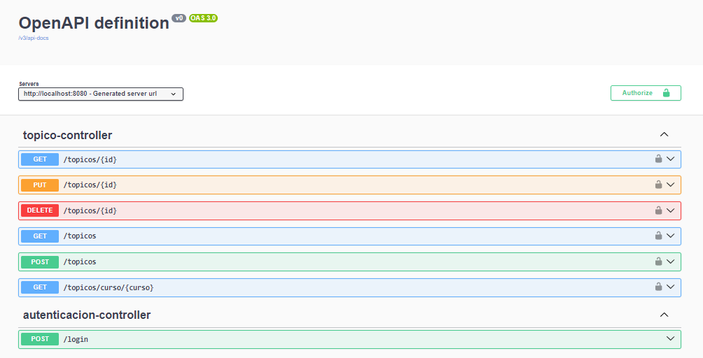

<h1 align="center"> ONE - Challenge ForoHub </h1>


## Descripción del Proyecto ##
El proyecto es el back-end de ForoHub en cual es una API Rest con usando Spring. 
La implementacion del CRUD , el cual se puede Crear Topicos, Listado de los Topicos con paginacion,
Listado de un Topico por Curso, Listado de un Topico por medio del id, Actualizacion de un topico, 
Eliminacion de un Topico por el id.

## Configuracion del proyecto ##

Clonar el Repositorio

### Configuración de la Base de Datos ###
1. Si usas Docker
- Variables de entorno
  Para la ejecucion del proyecto se tiene que crear el archivo de .env para poner las variables de entorno o crear dichas variables
  en las variables de entorno de su equipo (windows).

  ejemplo (archivo .env)

  

- Configuracion del archivo src/main/resources/application.properties (por defecto si clonas este repositorio)
  ```bash
    spring.application.name=literalura
    spring.datasource.url=jdbc:postgresql://${DB_HOST}:${PORT}/${DB}
    spring.datasource.username=${DB_USER}
    spring.datasource.password=${DB_PASSWORD}
    ```
- Ejecutar docker-compose en el cmd (en la raiz del proyecto)
  ```bash
   docker-compose up -d
  ```

2.  Configurar la Base de Datos (si tienes instalado no usar docker)

- Crea una base de datos en PostgreSQL para el proyecto.

- Actualiza el archivo src/main/resources/application.properties con tus credenciales de base de datos:
    ```bash
    spring.application.name=literalura
    spring.datasource.url=jdbc:postgresql://${DB_HOST}/${DB}
    spring.datasource.username=${DB_USER}
    spring.datasource.password=${DB_PASSWORD}
    ```
### API Rest ###
Para hacer la prueba de este proyecto back-end tiene que ir a la url: http://localhost:8080/swagger-ui/index.html
, para hacer las pruebas



##  Tecnologías Utilizadas ##
- JAVA
- Framework -> Spring Boot
- MYSQL
- Docker

## Autor ##
willson catacora valencia